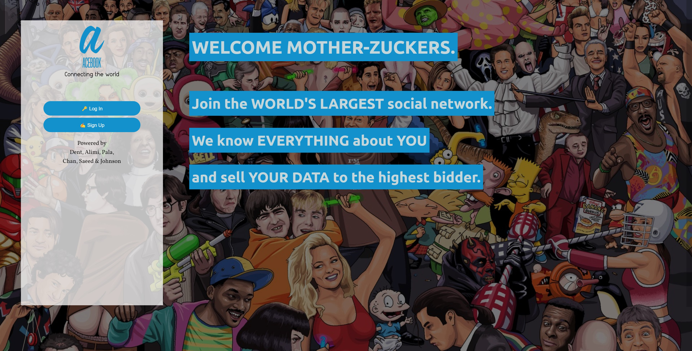
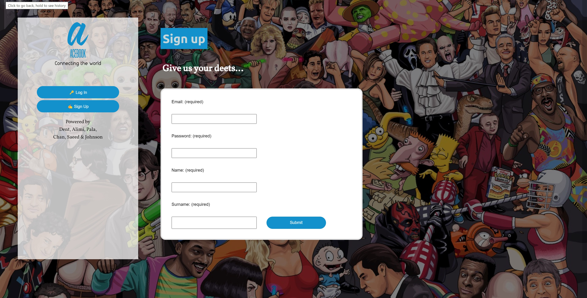
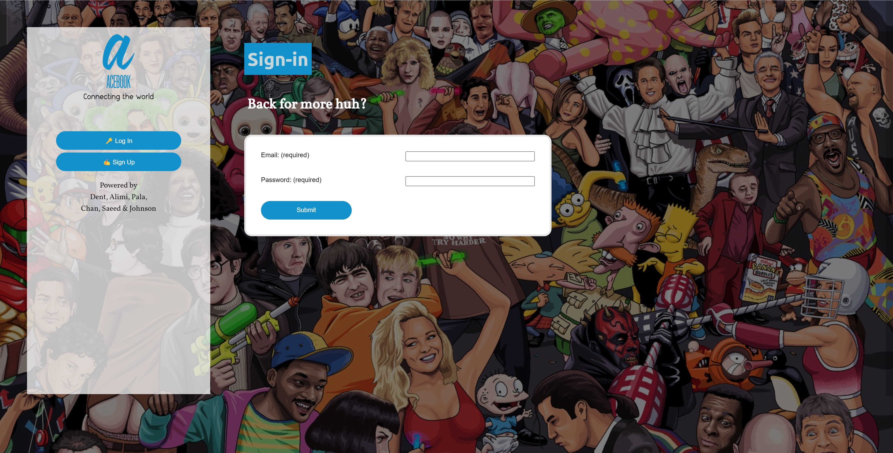
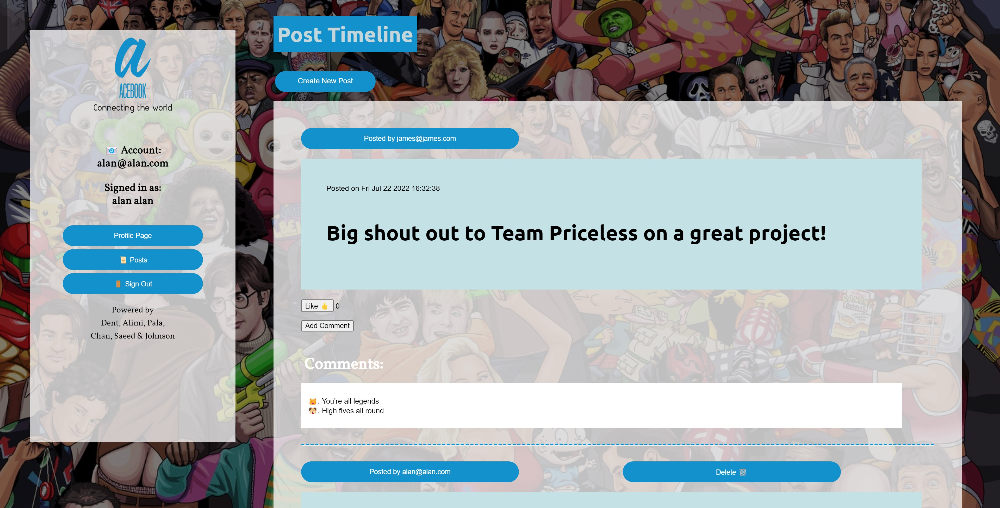

# Acebook

This is a Node.js engineering team project to create a alternative-reality clone of Facebook.

It uses:

- [Express](https://expressjs.com/) web framework for Node.js.
- [Nodemon](https://nodemon.io/) to reload the server automatically.
- [Handlebars](https://handlebarsjs.com/) to render view templates.
- [Mongoose](https://mongoosejs.com) to model objects in MongoDB.
- [ESLint](https://eslint.org) for linting.
- [Jest](https://jestjs.io/) for testing.
- [Cypress](https://www.cypress.io/) for end-to-end testing.
- [Bcrypt](https://www.npmjs.com/package/bcrypt) for password encryption.

## Github page:

https://github.com/IbrahimPala1/acebook-node-priceless

## Trello board:

https://trello.com/b/jaHA0ziM/priceless-ace-book

## Feature List

- User can signup for an account
  - Signing up twice with the same email address is not allowed
  - Signing with blank input fields is not allowed
- User can signin with an account
  - Signing in with blank input fields is not allowed
- User can create a post
  - A post can have multiple lines, it is displayed correctly on wall
  - Posts have date
  - Posts are displayed with most recent on top
- User can delete a post
- Users can react to a post by
  - liking a post (each user can only like a post once)
  - commenting on a post
- User has a Profile Page
  - User can make posts to another user on Profile Page
  - User can see posts made by themselves and made to them on Profile Page
- User passwords are encrypted using Bcrypt before they are stored in the database
- Jedi features
  - A random emoji is attached to each post comment made.

## Screenshots










## Quickstart

### Install Node.js

1. Install Node Version Manager (NVM)
   ```
   brew install nvm
   ```
   Then follow the instructions to update your `~/.bash_profile`.
2. Open a new terminal
3. Install the latest version of [Node.js](https://nodejs.org/en/), currently `18.1.0`.
   ```
   nvm install 18
   ```

### Set up your project

1. Fork this repository
2. Rename your fork to `acebook-<team name>`
3. Clone your fork to your local machine
4. Install Node.js dependencies
   ```
   npm install
   ```
5. Install an ESLint plugin for your editor. For example: [linter-eslint](https://github.com/AtomLinter/linter-eslint) for Atom.
6. Install MongoDB
   ```
   brew tap mongodb/brew
   brew install mongodb-community@5.0
   ```
   _Note:_ If you see a message that says `If you need to have mongodb-community@5.0 first in your PATH, run:`, follow the instruction. Restart your terminal after this.
7. Start MongoDB
   ```
   brew services start mongodb-community@5.0
   ```

### Check Mongo DB and X Server are running

1. On WSL2
   ```
   sudo service mongodb start
   ```
   Launch Xserver (with access control disabled for integration tests to work)

### Start

1. Start the server
   ```
   npm start
   ```
2. Browse to [http://localhost:3000](http://localhost:3000)

#### Start test server

The server must be running locally with test configuration for the
integration tests to pass.

1. Start the test server

```
npm run start:test
```

This starts the server on port `3030` and uses the `acebook_test` MongoDB database,
so that integration tests do not interact with the development server.

### Test

- Run all tests
  ```
  npm test
  ```
- Run a check
  ```bash
  npm run lint              # linter only
  npm run test:unit         # unit tests only
  npm run test:integration  # integration tests only
  ```

## Test Coverage

Test coverage is shown for unit tests by using collectCoverageFrom in jest.config.js. Jest calculates the coverage from the following directories:

- ./controllers/\*\*
- ./models/\*\*

Cypress test coverage is currently unavailable.

## MongoDB Tutorial

MongoDb documentation: https://www.mongodb.com/docs/manual/

Mongoosh documentation: https://mongoosejs.com/docs/queries.html

MongoDB Shell (mongosh) documentation: https://www.mongodb.com/docs/mongodb-shell/

The MongoDB Shell, mongosh, is a fully functional JavaScript and Node.js 16.x REPL environment for interacting with MongoDB deployments. Mongosh can be used to test queries and operations directly with the database.

With MongoDB Shell, we can interact with MongoDB using command lines in termainl:

```
$ mongosh
```

To see all databases available on the current connection, type:

```
> show dbs
acebook_test  64.00 KiB
admin         40.00 KiB
config        72.00 KiB
local         72.00 KiB
```

To connect to one database:

```
> use acebook_test
switched to db acebook_test
```

When connected to a database, it is possible to show the "collections", equialvent to TABLES in SQL:

```
> show collections
posts
users
```

It is possible to look into these collections:

```
> db.posts.find()
[
  {
    _id: ObjectId("62ce9ed31099b91369b89370"),
    message: 'Hello, world!',
    __v: 0
  },
  {
    _id: ObjectId("62ce9efa1099b91369b8937e"),
    message: 'Hello, world!',
    __v: 0
  },
   ...
]
```

It is also possible to view local MongoDB with TablePlus.

- Create a new connection...
- Mongo -> Create
- Name: Acebook_test; URL: mongodb://0.0.0.0/acebook_test
- Connect

## MongoDB Connection Errors?

Some people occasionally experience MongoDB connection errors when running the tests or trying to use the application. Here are some tips which might help resolve such issues.

- Check that MongoDB is installed using `mongo --version`
- Check that it's running using `brew services list`

If you have issues that are not resolved by these tips, please reach out to a coach and, once the issue is resolved, we can add a new tip!

## Known bugs

- User can't see posts made by other users on their own wall when using the profile button on the nav bar, but can see posts made by other users on their own wall when using the profile buttons on the main wall posts.
